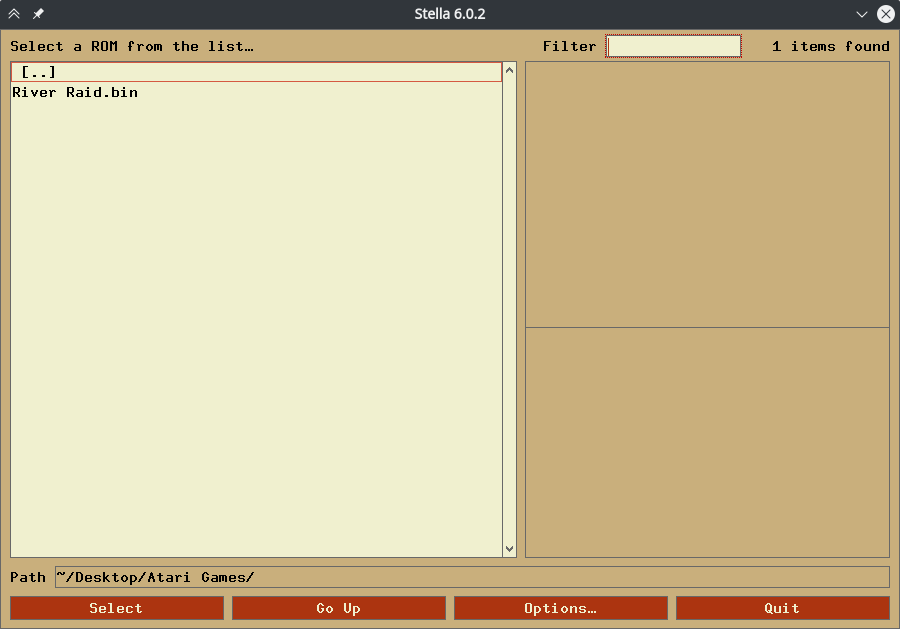
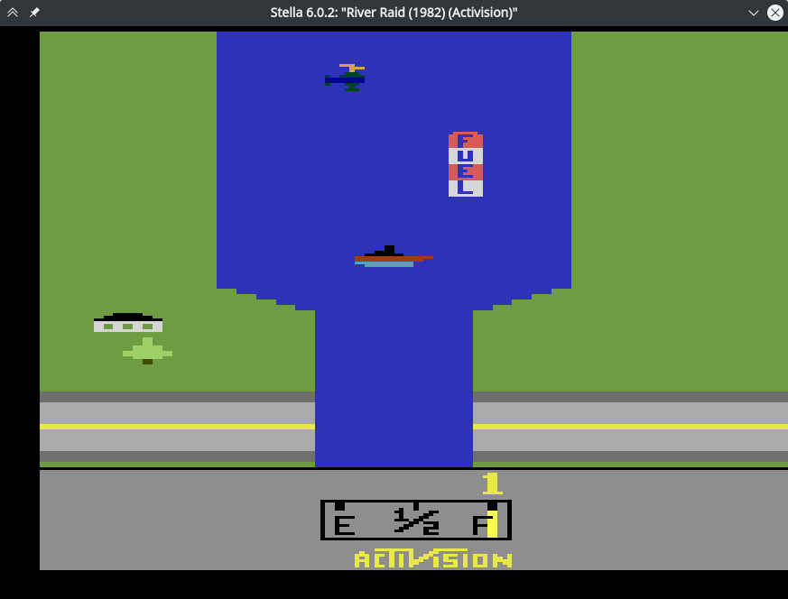
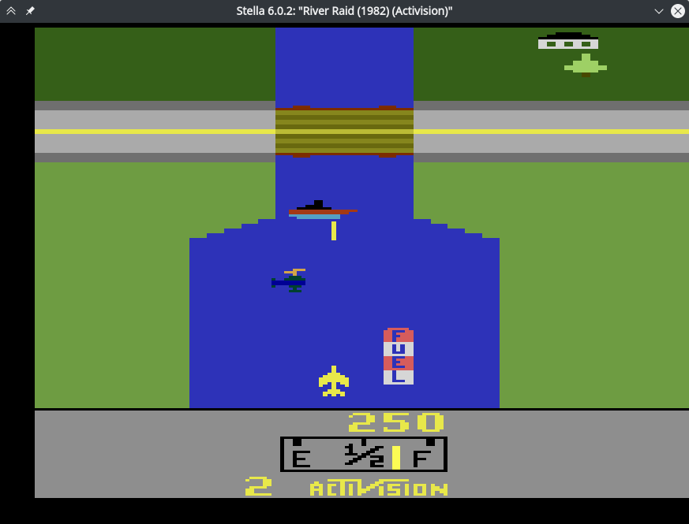
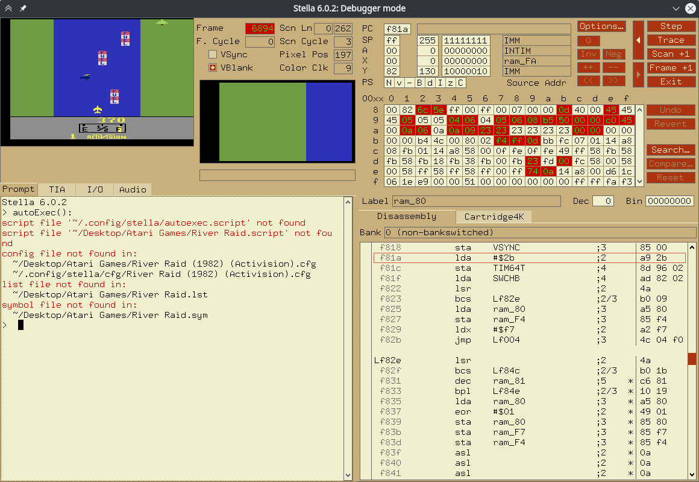
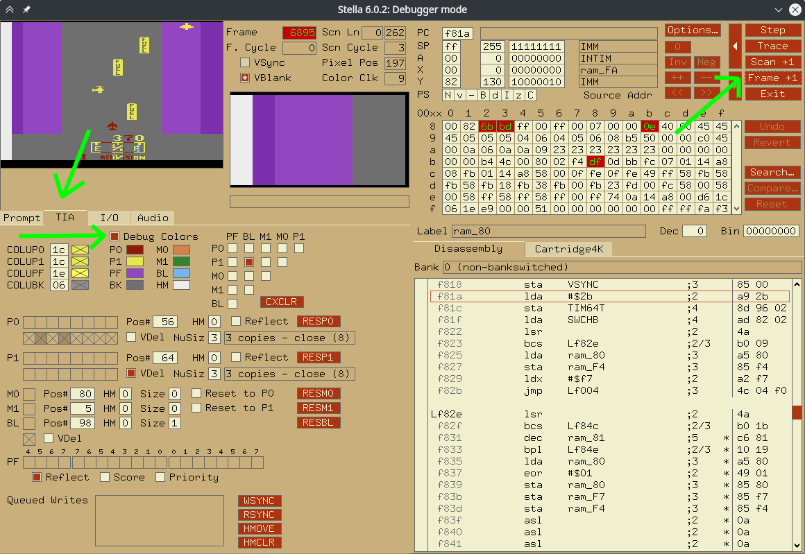
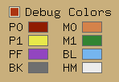
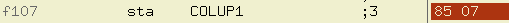
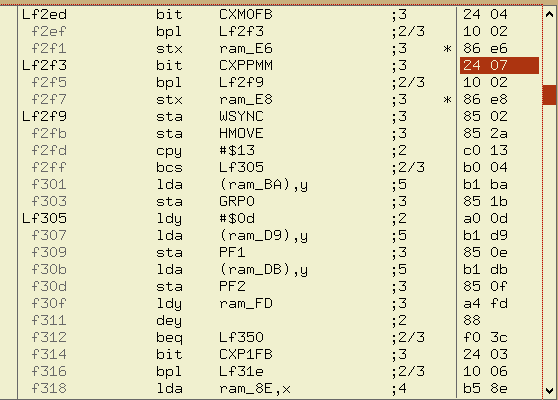

# Cracking the River Raid game with Stella Atari emulator
Recently; I wached a video about cracking the original Pac-man game written for the Atari 2600 video game console. I wanted to try the same technique, on another game. I choosen River Raid and successfully cracked it! Then I decided to document this operation which took almost a day.

***This document is inspired by the video I've watched. And I've seen almost all resources mentioned in this document; in the video.***

## Crack exactly what?
This game is playable for free these days. So the goal of this crack is not to make it playable for free. We are going to disable some game play features that will make you lose the game; such as colliding with enemy.

## What do I need to continue?
1. Stella emulator. Stella lets you both run and debug Atari 2600 games; Which is perfect for out usage. You can find it [here](https://stella-emu.github.io/downloads.html). 

    *If you are using Ubuntu 20.04 (like me); you might fail installing the deb file. Instead just install it from ubuntu package repositories via `sudo apt install stella`*

2. River Raid ROM. Get it from [here](http://www.atarimania.com/game-atari-2600-vcs-river-raid_s6826.html).
3. Some knowledge about computers and assembly language.

## Runing and playing the game
After installing Stella; run it! (🤯)
You should see something like this:

You can extract the downloaded ROM; or just open the zip file in Stella; by navigating to its location and double clicking on it.

To start the game; you need to press the `reset` button on the Atari 2600 console. On Stella; this key is by default mapped to the `F2` key. So press it and start playing the game. right and left arrows will move the player and space key will shoot some missiles.

There are three ways to lose the game:
1. Colliding with enemies or bridges 🚁 🚢 🌉 (You will find out why I putted bridges next to enemies)
2. Colliding with ground 🌲 (green parts)
3. Running out of fuel ⛽

## Talk about Atari 2600's collision detection system
Unlike modern games which use seprated systems or even seprated threads to render the game and simulate physics; Old games detect collisions while rendering! (🤯).
Atari lets you define a `limited number` of sprites, with `limited sizes`. Then you can tell the system where to render these sprites. During rendering; when the scanline moves; the system also checks for collision beetween sprites and change some registers accordingly. To explore more; press the `~` key (next to `1`) to enter Stella's debug mode. the game will be paused automatically.

Head over to `TIA` tab to see graphics and collision information. Then enable `Debug Colors` option. It will allow us to detect where sprites are rendered on the screen. To see changes; click `Frame +1` key to render another frame with debug colors.

This will give us a wiered looking image!
Lets forget about the in-game-GUI for now and focus on the color of the rest of the screen.

1. Player is rendered in red.
2. Enemies and fuel (gas) stations are rendered in yellow.
3. Green parts are rendered in purple.

By looking at the colors under the `Debug Colors` checkbox; You can see which sprite is associated with each part of the screen.

| Object Name                     | Atari Sprite ID |
|---------------------------------|-----------------|
| Player                          | P0              |
| Enemies and fuel (gas) stations | P1              |
| Green parts                     | PF              |

We can use the sprite ID of each object to check for collision!
For example to check for collisions between `Player` and `Enemies (or fuel stations)`; we can check for collision between `P0` and `P1`.

## Collision Registers
I found [a great resource](https://www.masswerk.at/rc2018/04/08.html) about this topic which I am going to just copy this table from.

| Register Name | Register Address | 7th Bit Meaning | 6th Bit Meaning |
|---------------|------------------|-----------------|-----------------|
| `CXM0P`       | `0x0`            | `M0-P1`         | `M0-P0`         |
| `CXM1P`       | `0x1`            | `M1-P0`         | `M1-P1`         |
| `CXP0FB`      | `0x2`            | `P0-PF`         | `P0-LB`         |
| `CXP1FB`      | `0x3`            | `P1-PF`         | `P1-BL`         |
| `CXM0FB`      | `0x4`            | `M0-PF`         | `M0-BL`         |
| `CXM1FB`      | `0x5`            | `M1-PF`         | `M1-BL`         |
| `CXBLPF`      | `0x6`            | `BL-PF`         | ***unused***    |
| `CXPPMM`      | `0x7`            | `P0-P1`         | `M0-M1`         |

This table shows what collision data is stored in which register.
For checking collision between `P0` and `P1`; we need to check if 7th (last) bit of `CXPPMM` register is set to `1`.

## Surfing the disassembly; Suffering `Ctrl-F` lessness
Now that we know which register stores `P0-P1` collision; We can start searching the disassembly of the game for usage of those registers.

Unfortunately I couldn't find a way to to that automatically in Stella. But I know two other ways for doing that:
1. Scrolling throw the disassembly window in Stella and look for `CXPPMM` (It will work because the code is very small but is a terrible idea)
2. Write a code to do that for us

First way is pretty straight forward. But second one is harder. Because if you want to search for a bit with value of `0x7` (`0x7` is address of `CXPPMM`); You will get alot of matches which do not mean `CXPPMM`. Like this:

Here; `0x07` means `COLUP1` instead of `CXPPMM`.

After following first way; you will find the first match at `0x2f3` (or `f2f3` in Stella):

Great! But what does it mean?

## The `bit` instruction
By looking at [here](https://www.c64-wiki.com/wiki/BIT_(assembler)); We will see that:
> Bit 7 (...) is transferred directly into the negative flag.

Did you noticed that?!

`bit CXPPMM` will do alot of stuff. One of them is moving 7th bit of `CXPPMM` to proccessor's negative flag.

So if the value stored in the negative flag is `1`; then `P0` is colliding with `P1`!

Awesome!

Next instruction is `bpl Lf2f9`. `bpl` means "Jump if positive". Being positive means negative flag is set to `0`.

So if negative flag is `0`; We will jump to `Lf2f9`. which means If `P0` and `P1` are **not** colliding; jump to `Lf2f9` and continue execution from there.

It means that between `Lf2f5` (aka `f2f5` aka `0x2f5`) and `Lf2f9` (aka `f2f9` aka `0x2f9`); Is the code that handles increasing fuel or losing the game. So we need to destroy that code (😈)

We cant just delete those two bytes. because it can break other branching or jumping locations. So we should replace them with something which does nothing.

There is a `nop` instruction which means "No Operation". It does nothing. We should change `stx ram_E8` to `nop nop`

Stella only allows you to modify the hex version of the disassembly. But I've got you covered! The hex equivalent to `nop` is `0xEA`. So just double click on the hex on the right side and replace `86 e8` with `ea ea`.

Now hit the `Exit` button (or `Run` button on newer versions) under the `Frame +1` button and enjoy playing game without ever losing :)

## BUT WAIT!
It didn't worked. I know. That is because there is one more thing to do.